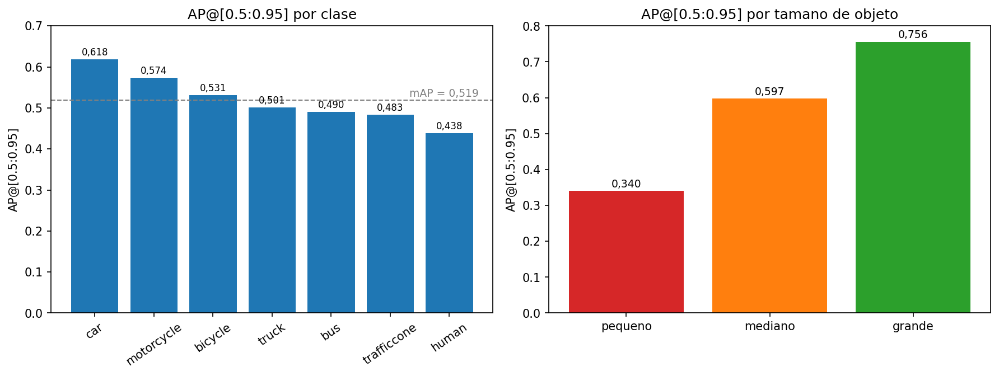
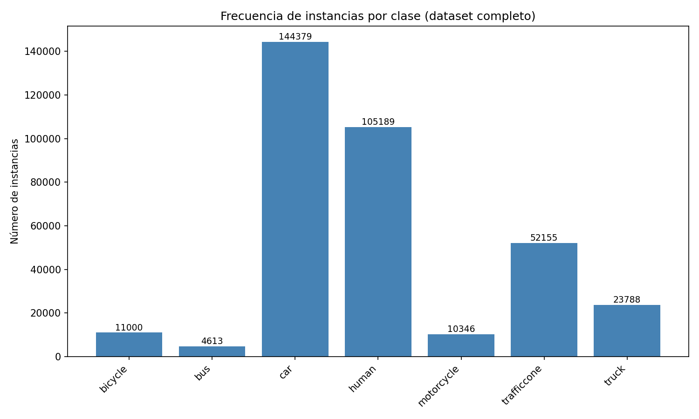
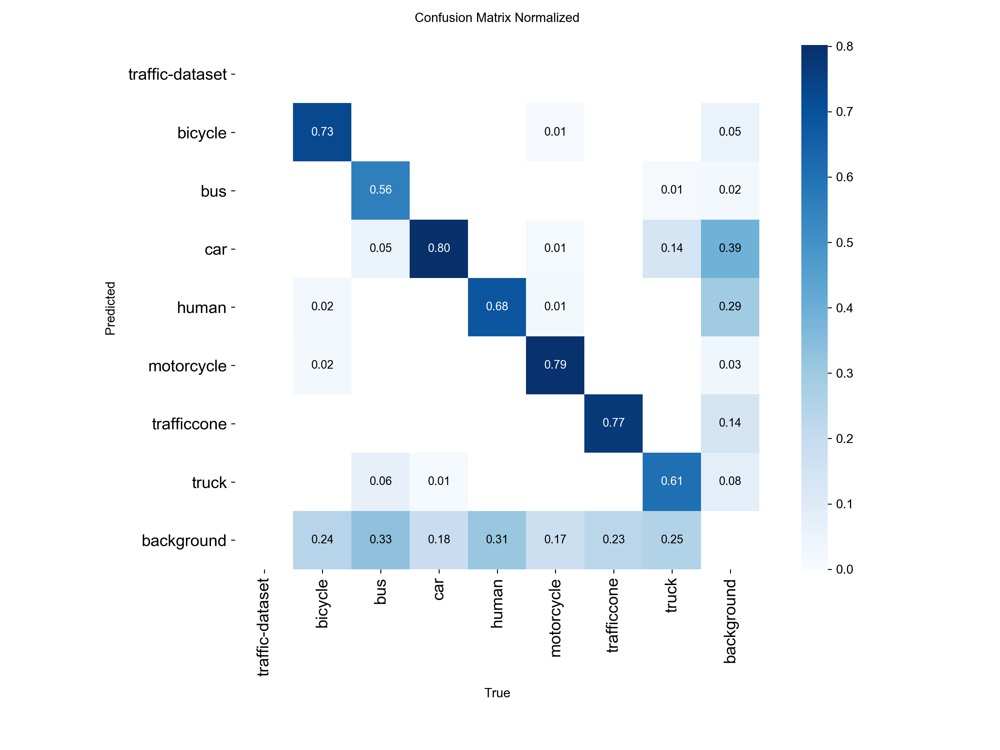
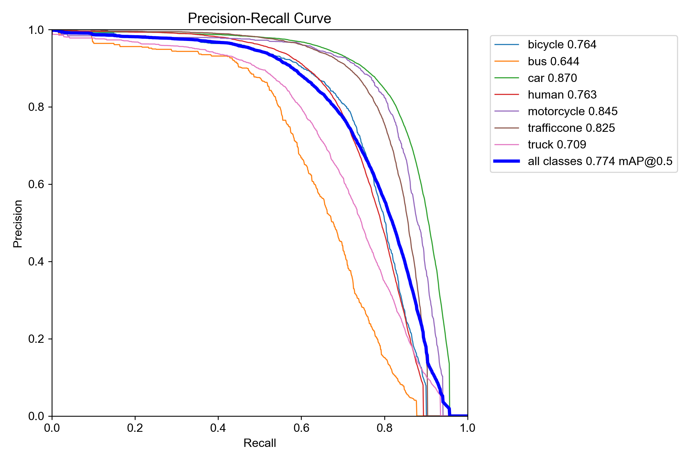
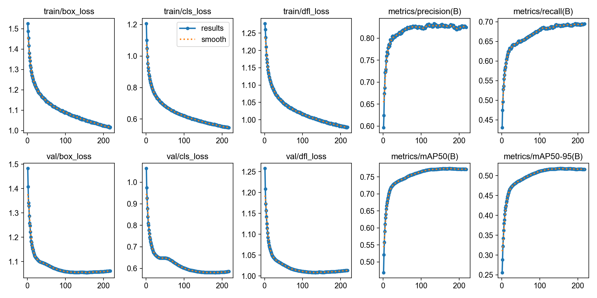

# Multi-Object Detection & Tracking for Autonomous Driving

**Fine-tuned YOLO11s + DeepSORT on 52,851 driving images · 7 road classes · real-time video tracking.**
Master's in Artificial Intelligence · UDIT · Computer Vision final project · 2026


> 🇪🇸 **Resumen:** detector YOLO11s ajustado (fine-tuning) sobre 52.851 imágenes de conducción y combinado con DeepSORT para seguir vehículos, peatones y conos en vídeo con identificadores estables. mAP@0.5 = 0,776 en test.

---

## Results

| Split | Precision | Recall | mAP@0.5 | mAP@0.5:0.95 |
|---|---:|---:|---:|---:|
| Validation (COCO eval) | — | — | 0.773 | 0.519 |
| **Test** | **0.835** | **0.689** | **0.776** | **0.527** |

<p align="center">
  
</p>

**Key finding:** performance is driven less by class frequency than by **object size and visual distinctiveness** — small objects reach AP 0.340 vs 0.756 for large ones, and *human* is the weakest class despite being the second most frequent.

<p align="center">
  
  
</p>

## Dataset

| Property | Value |
|---|---|
| Images | 52,851 (960 × 540) |
| Valid annotations | 351,469 |
| Classes | bicycle · bus · car · human · motorcycle · traffic cone · truck |
| Split | Stratified 70 / 20 / 10 (train / validation / test) |

Strong class imbalance (car 144k instances vs bus 4.6k) — handled through stratified splitting and evaluated per class and per object size.

## Approach

1. **Qualitative baseline** — YOLO11s pre-trained on COCO, no fine-tuning, as a reference for the domain gap.
2. **Experiment 1** — first fine-tuning run: good early peak (mAP@0.5 0.679) but numerically unstable, so discarded.
3. **Experiment 2 (final)** — full fine-tuning of YOLO11s · 960 px · AdamW · cosine LR (lr0 = 8e-4) · moderated mosaic (0.5) · early stopping · 218 epochs.
4. **Experiment 3** — first 12 layers frozen (`freeze=12`) → worse than Exp. 2: freezing limited adaptation to the driving domain.
5. **Tracking** — DeepSORT on top of the detector with a **4 + 1 cycle**: YOLO runs on 4 consecutive frames and the Kalman filter predicts the 5th, reducing detector calls by 20% while keeping every output frame. Confidence threshold 0.35, chosen from the F1-confidence curve (max F1 ≈ 0.33).

<p align="center">
  
  
</p>

## Repository contents

```
src/track_video.py               YOLO + DeepSORT video tracking (4+1 detect/predict cycle)
src/plot_ap_by_class_and_size.py AP analysis figure
results/                         Evaluation figures
```

```bash
pip install -r requirements.txt
python src/track_video.py --yolo_model best.pt --video_path input.mp4 --output_path tracked.mp4 --skip_frames 4
```

The dataset, trained weights and project report are **not published**.

---

**María Tocado Murillo** · Applied AI & Data Scientist · [LinkedIn](https://www.linkedin.com/in/mar%C3%ADa-tocado-murillo/)

© 2026 María Tocado Murillo. All rights reserved — see [LICENSE](LICENSE).
